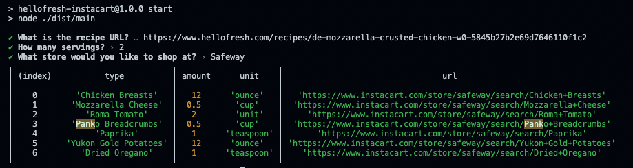

# Hellofresh Instacart Shopper
Simple script that scrapes Hello Fresh recipe for ingredients and get their Instacart url.

## Install
1. Clone `git clone git@github.com:moreSalt/hellofresh-instacart.git`
2. cd into the directory `cd hellofresh-instacart`
3. Install dependencies `npm install`
4. Build the program `npm run build`

## Usage
1. Start `npm start`
2. Input the link to the recipe. You can find recipes [here](https://www.hellofresh.com/recipes)
3. Select the amount of servings.
5. Select the store you would like to shop from.
6. The program will find all of the output a table of all that is required for the recipe plus urls to ingredients.

## Notes
- At this time I have no desire to auto add-to-cart ingredients.
- Ingredients like salt, pepper, oil, etc are ommitted as Hello Fresh expects you to already have these ingredients.